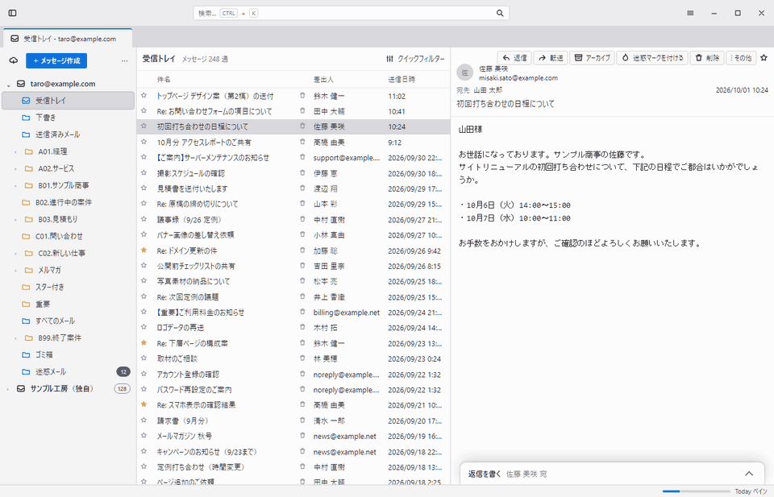
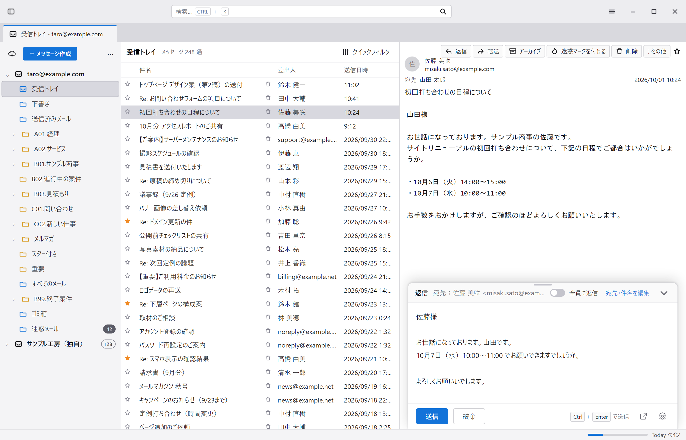
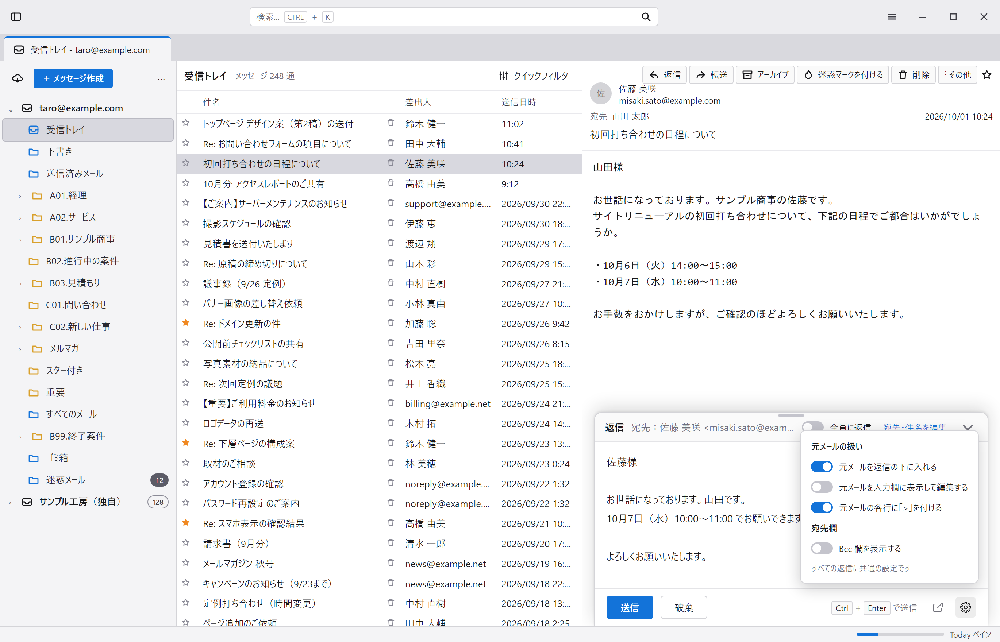

# Replyfold — Thunderbird の返信を、読んでいる画面の中で書く

Thunderbird は返信のたびに別ウインドウが開きます。Replyfold は Gmail のように、メールを読んでいる画面の下端に返信パネルを出し、その場で返信を書けるようにする拡張機能です。

**個人が自分用に作っている非公式の拡張です。商用利用・改変・再配布はできません。**利用の前に「[ライセンス](#ライセンス)」と「[免責](#免責)」を必ずお読みください。

*An unofficial Thunderbird extension for writing replies in a panel at the bottom of the message pane. Noncommercial use only; no modification or redistribution. See the [English summary](#english-summary).*

## 状態

試作段階です。動作を確認しているのは Thunderbird 156（月次リリース版）だけで、公式アドオンサイトには公開していません。仕様は予告なく変わります。

## できること

- **返信パネル**：メール表示エリアの下端からせり上がる。折りたたみ可。上端をドラッグして高さを変えられる
- **返信／全員に返信**の切り替え
- **差出人・宛先・Cc・件名の編集**。Bcc 欄は設定でオンにすると出る
- **下書きの自動保持**：別のメールに移っても、Thunderbird を再起動しても、書きかけが残る
- **下書きフォルダーへの保存**：書きかけを Thunderbird の「下書き」フォルダーにも保存する（オフにできる）。1通のメールにつき下書きは1通で、そのメールを開くたびにパネルに出る。**保存の瞬間、作成ウインドウが最小化された状態で一瞬開きます**。また、いったん Thunderbird 標準の保存先に保存してから表示中のアカウントの下書きフォルダーへ移すため、反映まで少し時間がかかります。公式の拡張 API でできる範囲の上限がこの挙動です（詳しくは「[下書き](#下書き)」）
- **元メールの扱いの設定**：元メールを入れる／入れない、入力欄に表示して編集する、各行に「>」を付ける
- **別ウインドウとの行き来**：パネルから標準の作成ウインドウへ、作成ウインドウからパネルへ
- `Ctrl+Enter` で送信

| 展開 | 設定 |
|---|---|
|  |  |

画面イメージの文言はすべて架空のサンプルです。

## 導入

公式アドオンサイトには公開していないため、インストール用ファイル（`.xpi`）から導入します。導入後は Thunderbird を再起動しても外れません。

1. [Releases](https://github.com/reilovewish/replyfold/releases/latest) から `replyfold-<バージョン>.xpi` をダウンロードする
2. Thunderbird の「アドオンとテーマ」→ 歯車 →「ファイルからアドオンをインストール...」で、ダウンロードした `.xpi` を選ぶ
3. 権限の確認が出たら「追加」を押す
4. メールを選び直すと、表示エリアの下端に「返信を書く」のバーが出る

ソースから作る場合は、Windows の PowerShell で、取得したフォルダーの直下から `./scripts/build-xpi.ps1` を実行すると `dist/` に `.xpi` ができます（他の環境では、`src` フォルダーの**中身**を zip に固め、拡張子を `.xpi` に変える）。

更新するときは、新しい版で同じ手順を繰り返すと上書きされます。下書きと設定は引き継がれます。

この拡張は Mozilla の署名を受けていません。Thunderbird は署名の無い拡張も導入できますが、将来この扱いが変わる可能性があります。

## 取り扱うデータ

**この拡張は、メールの内容・宛先・設定などのデータを外部へ一切送信しません。**通信を行う処理を含まず、利用状況の収集もしていません。

- 下書きと設定は、Thunderbird がこの拡張に割り当てる保存領域（お使いのパソコン内）に保存します
- 「下書きフォルダーにも保存する」がオン（初期値）のときは、Thunderbird 標準の下書き保存を通して、お使いのメールアカウントの「下書き」フォルダーにも保存します。IMAP のアカウントでは、通常の下書きと同じくメールサーバーに保存されます
- メールの送信は、Thunderbird 標準の送信機能を通して、お使いのメールアカウントから行われます

### 要求する権限と用途

| 権限 | 用途 |
|---|---|
| メッセージの読み取り（`messagesRead`） | 表示中のメールの差出人・宛先・件名・返信先を取得する |
| 表示中のメッセージの変更（`messagesModify`・`scripting`） | メール表示エリアに返信パネルを差し込む。メール自体は書き換えない |
| アカウント情報の読み取り（`accountsRead`） | 「全員に返信」で自分のアドレスを宛先から外す。下書きフォルダー・ごみ箱の場所を調べる |
| メッセージの作成・保存・送信（`compose`・`compose.save`・`compose.send`） | 返信を作成して送信する。下書きフォルダーへ保存する |
| メッセージの移動（`messagesMove`） | 下書きを表示中のアカウントの下書きフォルダーへ移す。破棄した下書きをごみ箱へ移す |
| メッセージの削除（`messagesDelete`） | 保存し直して古くなった版の下書きを消す |
| 定期実行（`alarms`） | 「一定の間隔で」下書きフォルダーへ保存する |
| 保存領域（`storage`） | 下書きと設定を保存する |

## 注意・制限

公式の拡張 API（MailExtension）だけで作っているため、次の制限があります。

### 送信

- **送信の瞬間、標準の作成ウインドウを最小化した状態で開いて送ります。**公式 API に、作成ウインドウを開かずに送る手段が無いためです。送信の進捗を示す小窓は表示されます
- 送信に失敗したときは、その作成ウインドウを前面に戻します。内容を確認して手で送るか、閉じてください
- 差出人の初期値は、元メールの宛先（To、次に Cc）に入っていた自分のアドレスです。見つからないときは、そのメールが入っているアカウントの既定の差出人になります。「宛先・件名を編集」で変更できます
- 差出人に選べるのは、Thunderbird に登録済みのアドレスだけです。署名は選んだ差出人のものが使われます
- **宛先・Cc・Bcc は、送信前に必ずご自身で確認してください。**パネルが初期表示する宛先は、Thunderbird 標準の返信と異なる場合があります
- Bcc 欄を隠している間は、アカウント設定の自動 Bcc がそのまま使われます。欄を出している間は、欄の内容で上書きされます

### パネルで書ける内容

- **本文は文字だけ**です。太字などの書式、添付ファイルは扱えません。必要なときは「別ウインドウで開く」で標準の作成ウインドウへ移ってください
- 元メールの引用は、画面に表示されている本文の文字から作ります。元メールの書式・画像・添付は引用に含まれません
- HTML 形式で作成するアカウントでは、入力欄に表示して編集した元メールは「>」の文字のまま送られます（引用ブロックにはなりません）

### 別ウインドウとの行き来

- **パネル → 別ウインドウ**：本文・宛先・Cc・Bcc・件名を引き継ぎます。作成ウインドウで編集している間、そのメールのパネルは「別ウインドウで編集中」として読み取り専用になります。作成ウインドウを閉じると、パネルで続きを書けます
- **別ウインドウ → パネル**（作成ウインドウのツールバーの「パネルに戻す」）：
  - 元のメールへ移り、パネルを開いた状態で表示します
  - パネルに移せるのは本文の文字・宛先・Cc・Bcc・件名だけです。**書式は外れます**（書式があるときは確認が出ます）
  - 添付ファイルは、下書きフォルダーへの保存がオンなら下書きに残ります（パネルでは追加・削除できません）。オフなら失われます（確認が出ます）
  - 返信の作成ウインドウ（下書きフォルダーから開いた返信の下書きを含む）でのみ使えます。新規作成・転送では使えません

### 表示位置

- パネルは**メール表示エリアの中にしか出せません**。メール一覧など他の領域の上に重ねることは、公式 API ではできません
- メールを複数選択しているとき、メールを表示していないとき、下書き・テンプレート・送信トレイのメールを表示しているときは、パネルは出ません

### 下書き

**下書きの挙動は、公式の拡張 API でできる範囲の上限です。**作成ウインドウを開かずに保存する、Thunderbird の終了時に保存する、といった動きは公式 API ではできないため、以下の形にしています。Thunderbird 内部に直接触れる方式（Experiment API）なら可能ですが、今後の Thunderbird で動かなくなる予定のため採用していません。

- 書きかけは入力のたびにこの拡張の保存領域へ書き込みます。Thunderbird を再起動しても、メールを別のフォルダーへ移しても引き継がれます
- **下書きフォルダーへの保存も、作成ウインドウを最小化した状態で一瞬開いて行います。**公式 API に、作成ウインドウを開かずに下書きを保存する手段が無いためです。保存のタイミングは歯車で選べます（別のメールへ移る・パネルを畳むとき／Thunderbird を最小化したとき／2〜60分ごと）
- Thunderbird の終了時には保存できません（公式 API に終了を待つ手段が無いため）。終了までに反映されなかった分は、次に起動したときに反映します
- 下書きの保存先は、初期値では表示中のメールのアカウントの下書きフォルダーです。Thunderbird はいったん差出人のアカウントの下書きフォルダーに保存するので、拡張がそこから移します。**そのため、下書きが表示中のアカウントの下書きフォルダーに現れるまで少し時間がかかります**（数秒〜十数秒。アカウントやサーバーによります）。移している間は、差出人のアカウントの下書きフォルダーに一時的に見えることがあります。歯車で「差出人のアカウント（Thunderbird 標準）」にもできます
- 1通のメールにつき、パネルで扱う下書きは1通です。標準の「返信」で書いた下書きが別にあるときは、パネルに差し替えるかの確認が出ます。差し替えた古い下書きは、設定に従って下書きフォルダーに残すか、指定したフォルダー（初期値はごみ箱）へ移します
- パネルの「破棄」と送信では、下書きフォルダーの下書きをごみ箱へ移します。保存し直して古くなった版は、ごみ箱を経由せずに消します（Thunderbird 標準の下書き保存と同じ扱い）
- 同じメールが複数のアカウントに届いている場合（転送など）、下書きは1通を共有します
- 下書きフォルダーへの保存をオフにすると、下書きはこの拡張の保存領域だけに持ち、他のパソコンとも同期されません
- 拡張を削除すると、この拡張の保存領域にある下書きと設定は消えます。下書きフォルダーに保存済みの下書きは残ります

### 対応バージョン

- Thunderbird 128 以降を対象にしていますが、動作を確認しているのは 156 だけです
- Thunderbird の更新によって、予告なく動かなくなることがあります

## ライセンス

Copyright (c) 2026 reilovewish

[PolyForm Strict License 1.0.0](LICENSE.md) で提供します。

- **認められること**：個人の利用、および非営利の目的での利用（取得して自分の Thunderbird に導入し、使うこと）
- **認められないこと**：商用利用／**改変**（自分用の手直しを含む）／**再配布**（改変の有無を問わず、他の場所での公開・配布・同梱を含む）
- 上記の範囲を超える利用を希望する場合は、事前に連絡先へご相談ください。許諾をお約束するものではありません
- 利用の可否に迷う場合は、利用しないでください

このライセンスは、いわゆるオープンソースライセンス（OSI 承認）ではありません。ライセンスの正文は英語の [LICENSE.md](LICENSE.md) であり、この節の日本語は説明です。両者に食い違いがある場合は正文が優先します。

## 免責

- 本ソフトウェアは**現状のまま**提供され、動作・正確性・特定の目的への適合性・継続的な提供を含め、いかなる保証もありません
- **法令が認める最大限の範囲で、作者は、本ソフトウェアの利用または利用できないことから生じた一切の損害について責任を負いません。**これには、メールの誤送信・送信の失敗・下書きやデータの消失・情報の漏えい・業務の中断・Thunderbird やメールアカウントの不具合を含みます
- 利用するかどうか、送信するかどうかは、利用者ご自身の判断と責任で行ってください。重要なメールには、Thunderbird 標準の作成ウインドウの利用をおすすめします
- 作者は、不具合の修正・問い合わせへの回答・更新の継続について義務を負いません

## サポートと要望

- 不具合の報告は [Issues](https://github.com/reilovewish/replyfold/issues) へどうぞ。ただし対応・返信は約束できません
- Issues にメールの本文・アドレスなどの個人情報を書かないでください。公開されます
- 改変を認めていないため、プルリクエストは受け付けていません
- 連絡先：reilovewish <info@reilovewish.com>（ライセンスに関するご連絡用。使い方の個別サポートは行っていません）

## 商標と関係

- Thunderbird は Mozilla Foundation の商標です。Gmail は Google LLC の商標です
- **本ソフトウェアは、Mozilla・MZLA Technologies・Google のいずれとも関係がなく、承認・提携・後援を受けたものではありません**
- 本ソフトウェアは Gmail のサービスに接続せず、Gmail の機能・デザイン・コードを含みません。「Gmail のように」は操作感の説明です

## English summary

Replyfold is an unofficial Thunderbird extension that lets you write replies in a panel docked at the bottom of the message pane, instead of a separate compose window — similar to Gmail.

- **Status**: Early prototype. Tested only on Thunderbird 156 (Release channel). Not listed on addons.thunderbird.net. The UI is Japanese only.
- **How it works**: Uses only the official MailExtension APIs. When you send, a standard compose window is opened minimized and used in the background. Drafts are kept in the extension's local storage and, optionally, saved to your Drafts folder in the same way. No data is sent anywhere except through Thunderbird's own sending and draft saving.
- **Install**: Download the `.xpi` from [Releases](https://github.com/reilovewish/replyfold/releases/latest), then use "Install Add-on From File..." in the Add-ons Manager.
- **License**: [PolyForm Strict License 1.0.0](LICENSE.md). **Noncommercial use only. Modification and redistribution are not permitted.**
- **Disclaimer**: Provided "as is", without warranty of any kind. To the maximum extent permitted by law, the author is not liable for any damages, including misdirected or failed emails and lost drafts. Always check the recipients before sending.
- **Trademarks**: Thunderbird is a trademark of the Mozilla Foundation. Gmail is a trademark of Google LLC. This project is not affiliated with, endorsed by, or sponsored by either.
- **Contact**: info@reilovewish.com (license inquiries only; no individual support)
